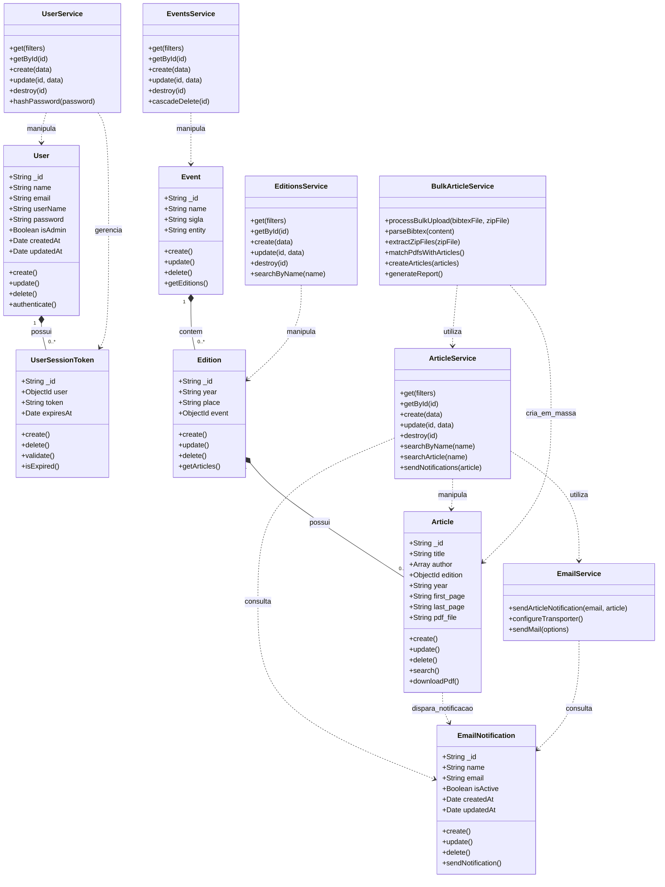
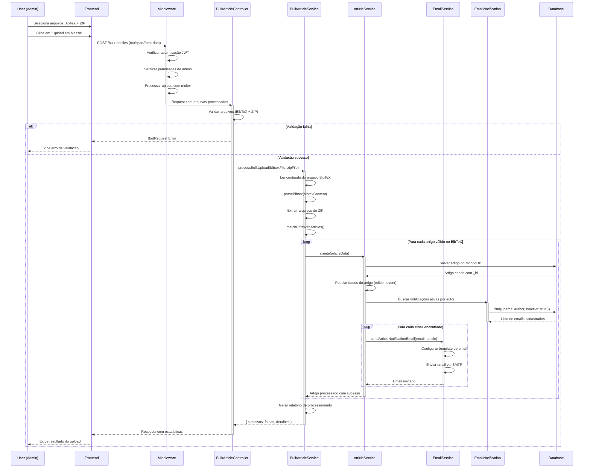
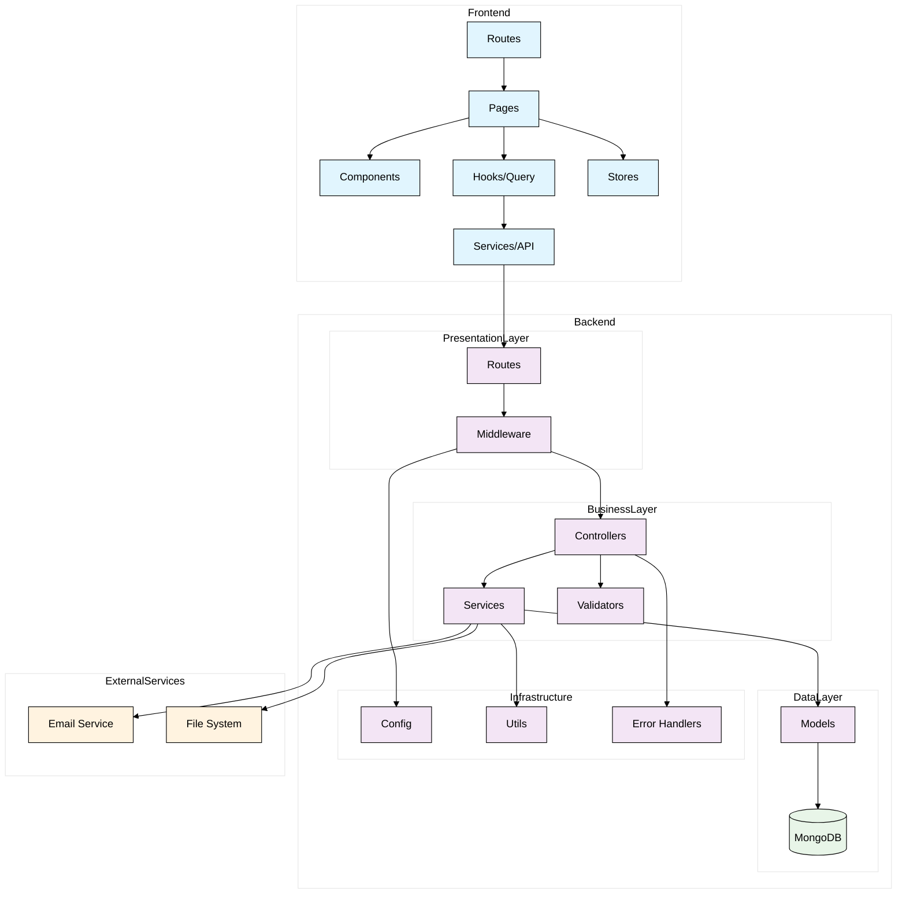

# Diagramas UML - Biblioteca Digital

## 1. Diagrama de Classes

## 2. Diagrama de Sequência - Upload em Massa de Artigos

## 3. Diagrama de Pacotes - Arquitetura do Sistema

Cada diagrama representa uma perspectiva diferente do sistema:

- **Diagrama de Classes**: Estrutura e relacionamentos das entidades
- **Diagrama de Sequência**: Fluxo da funcionalidade de Upload em Massa de Artigos
- **Diagrama de Pacotes**: Arquitetura geral do sistema
