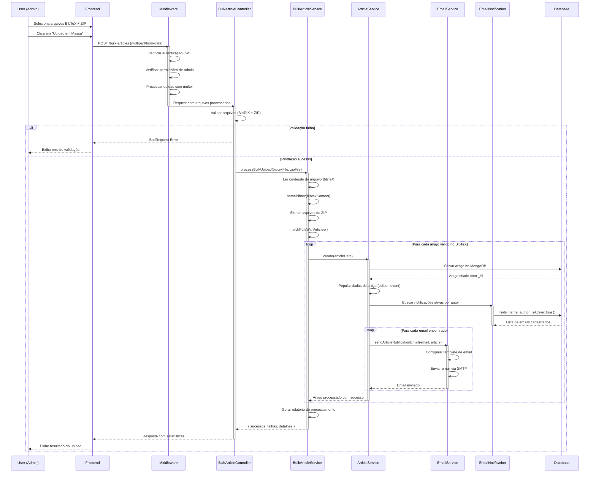

# Diagramas UML - Biblioteca Digital

## 1. Diagrama de Classes

```mermaid
classDiagram
    class User {
        +String _id
        +String name
        +String email
        +String userName
        +String password
        +Boolean isAdmin
        +Date createdAt
        +Date updatedAt
        +create()
        +update()
        +delete()
        +authenticate()
    }

    class UserSessionToken {
        +String _id
        +ObjectId user
        +String token
        +Date expiresAt
        +create()
        +delete()
        +validate()
        +isExpired()
    }

    class Event {
        +String _id
        +String name
        +String sigla
        +String entity
        +create()
        +update()
        +delete()
        +getEditions()
    }

    class Edition {
        +String _id
        +String year
        +String place
        +ObjectId event
        +create()
        +update()
        +delete()
        +getArticles()
    }

    class Article {
        +String _id
        +String title
        +Array author
        +ObjectId edition
        +String year
        +String first_page
        +String last_page
        +String pdf_file
        +create()
        +update()
        +delete()
        +search()
        +downloadPdf()
    }

    class EmailNotification {
        +String _id
        +String name
        +String email
        +Boolean isActive
        +Date createdAt
        +Date updatedAt
        +create()
        +update()
        +delete()
        +sendNotification()
    }

    class UserService {
        +get(filters)
        +getById(id)
        +create(data)
        +update(id, data)
        +destroy(id)
        +hashPassword(password)
    }

    class ArticleService {
        +get(filters)
        +getById(id)
        +create(data)
        +update(id, data)
        +destroy(id)
        +searchByName(name)
        +searchArticle(name)
        +sendNotifications(article)
    }

    class EventsService {
        +get(filters)
        +getById(id)
        +create(data)
        +update(id, data)
        +destroy(id)
        +cascadeDelete(id)
    }

    class EditionsService {
        +get(filters)
        +getById(id)
        +create(data)
        +update(id, data)
        +destroy(id)
        +searchByName(name)
    }

    class BulkArticleService {
        +processBulkUpload(bibtexFile, zipFile)
        +parseBibtex(content)
        +extractZipFiles(zipFile)
        +matchPdfsWithArticles()
        +createArticles(articles)
        +generateReport()
    }

    class EmailService {
        +sendArticleNotification(email, article)
        +configureTransporter()
        +sendMail(options)
    }

    %% Relacionamentos entre Models
    User ||--o{ UserSessionToken : "possui"
    Event ||--o{ Edition : "contém"
    Edition ||--o{ Article : "possui"
    
    %% Services manipulam Models
    UserService ..> User : "manipula"
    UserService ..> UserSessionToken : "gerencia"
    ArticleService ..> Article : "manipula"
    ArticleService ..> EmailNotification : "consulta"
    EventsService ..> Event : "manipula"
    EditionsService ..> Edition : "manipula"
    BulkArticleService ..> Article : "cria em massa"
    BulkArticleService ..> ArticleService : "utiliza"
    
    %% Notificações relacionadas aos artigos
    Article ..> EmailNotification : "dispara notificação"
    ArticleService ..> EmailService : "utiliza"
    EmailService ..> EmailNotification : "consulta"
```

## 2. Diagrama de Sequência - Upload em Massa de Artigos



## 3. Diagrama de Pacotes - Arquitetura do Sistema

```mermaid
graph TD
    subgraph "📱 Frontend Layer (React)"
        subgraph "Presentation"
            FP[Pages]
            FC[Components]
            FL[Layouts]
        end
        
        subgraph "State Management"
            FST[Stores/Zustand]
            FH[Hooks/React Query]
        end
        
        subgraph "Services"
            FS[API Services]
            FR[Routes]
        end
        
        FP --> FC
        FP --> FST
        FP --> FH
        FH --> FS
        FR --> FP
    end
    
    subgraph "🔧 Backend Layer (Node.js/Express)"
        subgraph "🌐 Presentation Layer"
            R[Routes]
            MW[Middleware]
            MW1[verifyJWT]
            MW2[verifyAdmin]
            MW3[fileUpload]
            MW4[bulkUpload]
        end
        
        subgraph "🏗️ Business Layer"
            CT[Controllers]
            SV[Services]
            VAL[Validators]
            
            subgraph "Controllers"
                CT1[ArticleController]
                CT2[EventsController]
                CT3[EditionsController]
                CT4[UserController]
                CT5[SessionController]
                CT6[BulkArticleController]
                CT7[EmailNotificationController]
            end
            
            subgraph "Services"
                SV1[ArticleService]
                SV2[EventsService]
                SV3[EditionsService]
                SV4[UserService]
                SV5[SessionService]
                SV6[BulkArticleService]
                SV7[EmailService]
            end
        end
        
        subgraph "💾 Data Layer"
            M[Models]
            DB[(MongoDB)]
            
            subgraph "Models"
                M1[ArticleModel]
                M2[EventsModel]
                M3[EditionsModel]
                M4[UserModel]
                M5[UserSessionTokenModel]
                M6[EmailNotificationModel]
            end
        end
        
        subgraph "🛠️ Infrastructure"
            CFG[Config]
            UT[Utils]
            ERR[Error Handlers]
            
            subgraph "Config"
                CFG1[Express Config]
                CFG2[MongoDB Config]
                CFG3[CORS Config]
                CFG4[Server Config]
            end
            
            subgraph "Utils"
                UT1[General Utils]
                UT2[Libs (bcrypt, jwt)]
                UT3[Validation Utils]
            end
        end
    end
    
    subgraph "🌍 External Services"
        EMAIL[📧 Email Service SMTP]
        FS_STORAGE[📁 File System]
        UPLOADS[📎 Uploads Directory]
    end
    
    %% Frontend to Backend
    FS -.->|HTTP/REST API| R
    
    %% Backend Flow - Presentation Layer
    R --> MW
    MW --> MW1
    MW --> MW2
    MW --> MW3
    MW --> MW4
    MW --> CT
    
    %% Business Layer Flow
    CT --> CT1
    CT --> CT2
    CT --> CT3
    CT --> CT4
    CT --> CT5
    CT --> CT6
    CT --> CT7
    
    CT --> VAL
    CT --> SV
    
    SV --> SV1
    SV --> SV2
    SV --> SV3
    SV --> SV4
    SV --> SV5
    SV --> SV6
    SV --> SV7
    
    %% Data Layer Flow
    SV --> M
    M --> M1
    M --> M2
    M --> M3
    M --> M4
    M --> M5
    M --> M6
    M --> DB
    
    %% Infrastructure connections
    CT --> ERR
    SV --> UT
    MW --> CFG
    
    CFG --> CFG1
    CFG --> CFG2
    CFG --> CFG3
    CFG --> CFG4
    
    UT --> UT1
    UT --> UT2
    UT --> UT3
    
    %% External connections
    SV7 --> EMAIL
    SV --> FS_STORAGE
    MW3 --> UPLOADS
    MW4 --> UPLOADS
    
    %% Styling
    classDef frontend fill:#e3f2fd,stroke:#1976d2,stroke-width:2px
    classDef presentation fill:#f3e5f5,stroke:#7b1fa2,stroke-width:2px
    classDef business fill:#e8f5e8,stroke:#388e3c,stroke-width:2px
    classDef data fill:#fff3e0,stroke:#f57c00,stroke-width:2px
    classDef infrastructure fill:#fce4ec,stroke:#c2185b,stroke-width:2px
    classDef external fill:#f1f8e9,stroke:#689f38,stroke-width:2px
    
    class FP,FC,FL,FST,FH,FS,FR frontend
    class R,MW,MW1,MW2,MW3,MW4 presentation
    class CT,SV,VAL,CT1,CT2,CT3,CT4,CT5,CT6,CT7,SV1,SV2,SV3,SV4,SV5,SV6,SV7 business
    class M,DB,M1,M2,M3,M4,M5,M6 data
    class CFG,UT,ERR,CFG1,CFG2,CFG3,CFG4,UT1,UT2,UT3 infrastructure
    class EMAIL,FS_STORAGE,UPLOADS external
```