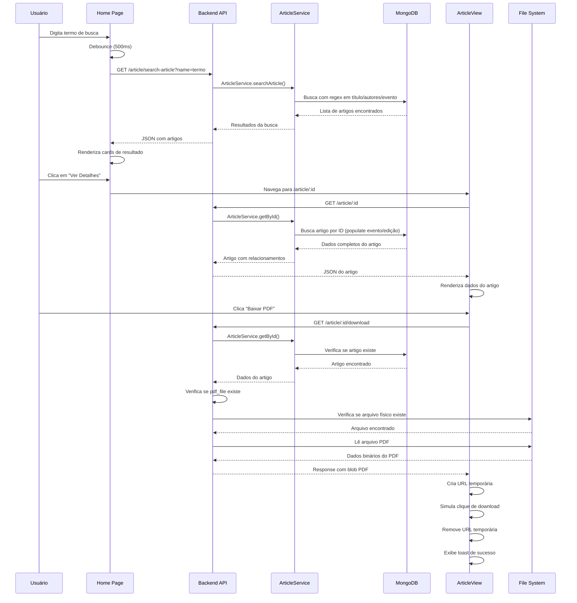

# 📚 Biblioteca Digital

Sistema completo de gerenciamento de biblioteca digital para artigos acadêmicos, desenvolvido como projeto da disciplina de Engenharia de Software. O sistema oferece funcionalidades avançadas de upload de PDFs, processamento de arquivos BibTeX, sistema de notificações por email e controle granular de acesso.

## 👥 Equipe de Desenvolvimento

- **Ana Paula** - Responsável por Design/Layout e UI/UX
- **Ravi** - Responsável pela arquitetura do sistema e backend
- **Vanessa** - Responsável pelo sistema de emails e gestão de usuários

## 🎯 Objetivos do Projeto

Este sistema foi desenvolvido para atender às necessidades de:
- Pesquisadores que precisam organizar e compartilhar artigos
- Administradores de eventos acadêmicos 
- Usuários que desejam receber notificações sobre novos artigos
- Comunidade acadêmica que necessita de acesso fácil a publicações

## 🏗️ Arquitetura do Sistema

### Diagrama de Pacotes

```mermaid
graph TB
    subgraph "Frontend - React"
        subgraph "Pages"
            P1[Home]
            P2[ArticleView]
            P3[AdminPage]
            P4[Login]
            P5[Events]
            P6[Editions]
        end
        
        subgraph "Components"
            C1[Header]
            C2[ArticleCreateForm]
            C3[ArticleEditForm]
            C4[BulkUploadForm]
            C5[UserCreateForm]
            C6[SearchBar]
        end
        
        subgraph "Services"
            S1[API Endpoints]
            S2[Authentication Store]
        end
        
        subgraph "Hooks"
            H1[useGetArticle]
            H2[useSearchArticle]
            H3[useGetEvents]
        end
    end
    
    subgraph "Backend - Node.js/Express"
        subgraph "Routes"
            R1[ArticleRoutes]
            R2[EventsRoutes]
            R3[EditionsRoutes]
            R4[UserRoutes]
            R5[SessionRoutes]
            R6[BulkRoutes]
        end
        
        subgraph "Controllers"
            CT1[ArticleController]
            CT2[EventsController]
            CT3[EditionsController]
            CT4[UserController]
            CT5[SessionController]
            CT6[BulkArticleController]
        end
        
        subgraph "Services"
            SV1[ArticleService]
            SV2[EventsService]
            SV3[EditionsService]
            SV4[UserService]
            SV5[SessionService]
            SV6[BulkArticleService]
        end
        
        subgraph "Models"
            M1[ArticleModel]
            M2[EventsModel]
            M3[EditionsModel]
            M4[UserModel]
            M5[UserSessionTokenModel]
        end
        
        subgraph "Middleware"
            MW1[verifyJWT]
            MW2[verifyAdmin]
            MW3[fileUpload]
            MW4[errorHandler]
        end
        
        subgraph "Validators"
            V1[ArticleValidator]
            V2[EventsValidator]
            V3[EditionsValidator]
            V4[UserValidator]
            V5[SessionValidator]
        end
    end
    
    subgraph "Database"
        DB[(MongoDB)]
    end
    
    subgraph "File Storage"
        FS[PDF Files]
    end
    
    %% Connections
    P1 --> S1
    P2 --> H1
    P3 --> C2
    C2 --> S1
    S1 --> R1
    R1 --> CT1
    CT1 --> SV1
    SV1 --> M1
    M1 --> DB
    CT1 --> FS
    MW1 --> CT1
    MW2 --> CT1
    MW3 --> CT1
    V1 --> CT1
```



### Diagrama de Sequência - Fluxo de Criação de Artigo com PDF

```mermaid
sequenceDiagram
    participant U as Usuário Admin
    participant F as Frontend (React)
    participant API as Backend API
    participant MW as Middleware
    participant V as Validator
    participant S as ArticleService
    parameter BV as BulkArticleService
    participant DB as MongoDB
    participant FS as File System

    U->>F: Acessa formulário de criação
    F->>F: Renderiza ArticleCreateForm
    
    U->>F: Preenche dados + seleciona PDF
    U->>F: Submete formulário
    
    F->>F: Cria FormData com arquivo
    F->>API: POST /article (multipart/form-data)
    
    API->>MW: verifyJWT
    MW->>MW: Valida token JWT
    MW-->>API: Token válido
    
    API->>MW: verifyAdmin
    MW->>MW: Verifica privilégios admin
    MW-->>API: Admin verificado
    
    API->>MW: fileUpload middleware
    MW->>MW: Valida tipo PDF
    MW->>FS: Salva arquivo em /uploads/articles/
    MW-->>API: Arquivo salvo + path
    
    API->>V: ArticleValidator.create()
    V->>V: Valida campos obrigatórios
    V->>V: Valida formato BibTeX
    V-->>API: Dados validados
    
    API->>S: ArticleService.create()
    S->>BV: Valida evento existe
    BV->>DB: Busca evento por nome
    DB-->>BV: Evento encontrado
    BV-->>S: Validação aprovada
    
    S->>BV: Valida edição existe
    BV->>DB: Busca edição por nome + evento
    DB-->>BV: Edição encontrada
    BV-->>S: Validação aprovada
    
    S->>DB: Cria novo artigo
    DB-->>S: Artigo criado com ID
    
    S-->>API: Artigo criado
    API-->>F: Status 201 + dados do artigo
    F->>F: Exibe toast de sucesso
    F->>F: Atualiza lista de artigos
```

### Diagrama de Sequência - Fluxo de Busca e Download de PDF



## 🚀 Funcionalidades Principais

### 👨‍💼 Para Administradores
- **Gerenciamento Completo de Eventos**: Criar, editar e excluir eventos acadêmicos
- **Gestão de Edições**: Organizar edições por ano e local de cada evento
- **Upload Individual de Artigos**: Cadastro manual com upload de PDF
- **Upload em Massa**: Processamento de arquivos BibTeX + ZIP com múltiplos PDFs
- **Gerenciamento de Usuários**: Criar e administrar contas de usuário
- **Dashboard Administrativo**: Interface completa para gestão do sistema

### 👤 Para Usuários
- **Sistema de Busca Avançada**: Pesquisa por título, autor e nome de evento
- **Navegação Intuitiva**: Páginas dedicadas para eventos, edições e artigos
- **Perfil Personalizado**: Visualização dos próprios artigos organizados por ano
- **Download de PDFs**: Acesso direto aos arquivos dos artigos
- **Sistema de Notificações**: Cadastro para receber emails sobre novos artigos

### 🔧 Funcionalidades Técnicas
- **Autenticação JWT**: Sistema seguro de login/logout
- **Controle de Acesso**: Operações administrativas protegidas
- **Validação Rigorosa**: Verificação de integridade de dados
- **Upload Seguro**: Validação de tipos de arquivo e tamanho
- **Sistema de Email**: Notificações automáticas via SMTP
- **Processamento BibTeX**: Parser avançado para importação em massa

## 🛠️ Stack Tecnológica

### Frontend
- **React 18** com Hooks
- **React Router** para roteamento
- **Styled Components** para estilização
- **React Hook Form** para formulários
- **React Query** para gerenciamento de estado
- **Framer Motion** para animações
- **Lucide React** para ícones

### Backend
- **Node.js** com Express.js
- **MongoDB** com Mongoose ODM
- **JWT** para autenticação e autorização
- **Multer** para upload e processamento de arquivos
- **Zod** para validação de schemas
- **Bcrypt** para hash de senhas
- **Nodemailer** para envio de emails
- **BibTeX Parser** para processamento de arquivos acadêmicos
- **Winston** para logging e monitoramento

### Ferramentas de Desenvolvimento
- **Vite** para build e desenvolvimento do frontend
- **ESLint** para análise estática de código
- **Prettier** para formatação automática
- **React Query** para cache e sincronização de dados
- **Zustand** para gerenciamento de estado global

## 📁 Estrutura do Projeto

```
biblioteca-digital/
├── biblioteca-digital-backend/
│   ├── src/
│   │   ├── controllers/     # Controladores da API
│   │   ├── services/        # Lógica de negócio
│   │   ├── models/          # Modelos do MongoDB
│   │   ├── routes/          # Definição das rotas
│   │   ├── middleware/      # Middlewares personalizados
│   │   ├── validators/      # Validadores de entrada
│   │   ├── config/          # Configurações do sistema
│   │   └── utils/           # Utilitários gerais
│   └── uploads/             # Armazenamento de arquivos
├── biblioteca-digital-web-frontend/
│   ├── src/
│   │   ├── components/      # Componentes reutilizáveis
│   │   ├── pages/           # Páginas da aplicação
│   │   ├── hooks/           # Hooks personalizados
│   │   ├── services/        # Serviços de API
│   │   ├── stores/          # Gerenciamento de estado
│   │   └── styles/          # Estilos globais
│   └── public/              # Arquivos públicos
```

## 🔧 Configuração e Execução

### Pré-requisitos
- **Node.js** 18+ 
- **MongoDB** (local ou Atlas)
- **npm** ou **yarn**
- **Git** para controle de versão

### Configuração do Backend

1. **Navegue para o diretório do backend:**
```bash
cd biblioteca-digital-backend
```

2. **Instale as dependências:**
```bash
npm install
```

3. **Configure as variáveis de ambiente:**
Crie um arquivo `.env` com:
```env
MONGODB_URI=mongodb://localhost:27017/biblioteca-digital
JWT_SECRET=sua_chave_secreta_jwt
EMAIL_USER=seu_email@gmail.com
EMAIL_PASS=sua_senha_app_gmail
PORT=3333
```

4. **Inicie o servidor:**
```bash
npm start
```

O backend estará rodando em `http://localhost:3333`

### Configuração do Frontend

1. **Navegue para o diretório do frontend:**
```bash
cd biblioteca-digital-web-frontend
```

2. **Instale as dependências:**
```bash
npm install
```

3. **Configure a URL da API:**
Verifique o arquivo `src/services/api/index.js` e ajuste a baseURL se necessário.

4. **Inicie o servidor de desenvolvimento:**
```bash
npm run dev
```

O frontend estará acessível em `http://localhost:5173`

### � Scripts Disponíveis

#### Backend
- `npm start` - Inicia o servidor em modo produção
- `npm run dev` - Inicia com nodemon para desenvolvimento
- `npm run lint` - Executa verificação de código

#### Frontend
- `npm run dev` - Servidor de desenvolvimento
- `npm run build` - Build para produção
- `npm run preview` - Preview da build de produção
- `npm run lint` - Verificação de código

## 🗃️ Estrutura do Banco de Dados

### Coleções Principais
- **Users**: Usuários do sistema (admins e usuários comuns)
- **Events**: Eventos acadêmicos (congressos, simpósios, etc.)
- **Editions**: Edições específicas de cada evento por ano
- **Articles**: Artigos acadêmicos com metadados e PDFs
- **UserSessionTokens**: Tokens de sessão para autenticação
- **EmailNotifications**: Cadastros para notificações por email

## 🔐 Sistema de Autenticação

O sistema utiliza **JWT (JSON Web Tokens)** para autenticação:
- Tokens são gerados no login e armazenados no frontend
- Middleware `verifyJWT` valida tokens em rotas protegidas
- Middleware `verifyAdmin` restringe acesso a funcionalidades administrativas
- Sistema de refresh token para sessões longas

## 📧 Sistema de Notificações

- **Cadastro voluntário** para receber notificações
- **Notificações automáticas** quando novos artigos são publicados
- **Matching inteligente** entre nomes de autores e cadastros
- **Templates personalizados** de email
- **Sistema de ativação/desativação** de notificações

## 🎨 Design System

O projeto implementa um design system consistente com:
- **Paleta de cores** personalizada com tons de verde
- **Tipografia** responsiva e acessível
- **Componentes reutilizáveis** com Styled Components
- **Animações suaves** com Framer Motion
- **Layout responsivo** para todos os dispositivos

## 📊 Documentação Adicional

Este repositório inclui documentação complementar:
- **[BACKLOG_SPRINT.md](./BACKLOG_SPRINT.md)** - Backlog detalhado da sprint com histórias de usuário
- **[RELATORIO_USO_IA.md](./RELATORIO_USO_IA.md)** - Relatório sobre uso de IA no desenvolvimento
- **[DIAGRAMAS_UML.md](./DIAGRAMAS_UML.md)** - Diagramas UML do sistema (Classe, Sequência, Pacotes)

## 🤝 Contribuindo

Este é um projeto acadêmico, mas sugestões e melhorias são bem-vindas:
1. Faça um fork do projeto
2. Crie uma branch para sua feature (`git checkout -b feature/nova-feature`)
3. Commit suas mudanças (`git commit -m 'Adiciona nova feature'`)
4. Push para a branch (`git push origin feature/nova-feature`)
5. Abra um Pull Request

## 📝 Licença

Este projeto foi desenvolvido para fins acadêmicos como parte do curso de Engenharia de Software. O código está disponível sob licença MIT para fins educacionais.