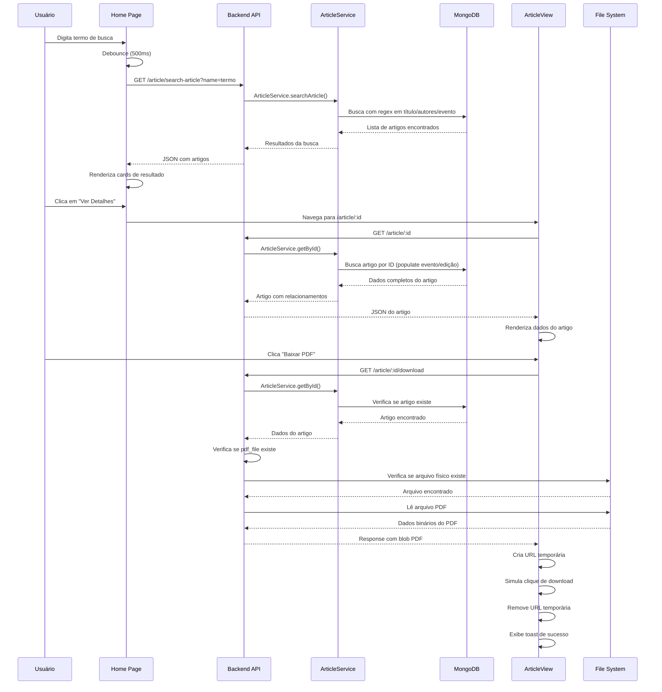

# Biblioteca Digital

Sistema de gerenciamento de biblioteca digital para artigos acadêmicos com suporte a upload de PDFs, validação BibTeX e sistema de autenticação com controle de acesso administrativo.

## 🏗️ Arquitetura do Sistema

### Diagrama de Pacotes

```mermaid
graph TB
    subgraph "Frontend - React"
        subgraph "Pages"
            P1[Home]
            P2[ArticleView]
            P3[AdminPage]
            P4[Login]
            P5[Events]
            P6[Editions]
        end
        
        subgraph "Components"
            C1[Header]
            C2[ArticleCreateForm]
            C3[ArticleEditForm]
            C4[BulkUploadForm]
            C5[UserCreateForm]
            C6[SearchBar]
        end
        
        subgraph "Services"
            S1[API Endpoints]
            S2[Authentication Store]
        end
        
        subgraph "Hooks"
            H1[useGetArticle]
            H2[useSearchArticle]
            H3[useGetEvents]
        end
    end
    
    subgraph "Backend - Node.js/Express"
        subgraph "Routes"
            R1[ArticleRoutes]
            R2[EventsRoutes]
            R3[EditionsRoutes]
            R4[UserRoutes]
            R5[SessionRoutes]
            R6[BulkRoutes]
        end
        
        subgraph "Controllers"
            CT1[ArticleController]
            CT2[EventsController]
            CT3[EditionsController]
            CT4[UserController]
            CT5[SessionController]
            CT6[BulkArticleController]
        end
        
        subgraph "Services"
            SV1[ArticleService]
            SV2[EventsService]
            SV3[EditionsService]
            SV4[UserService]
            SV5[SessionService]
            SV6[BulkArticleService]
        end
        
        subgraph "Models"
            M1[ArticleModel]
            M2[EventsModel]
            M3[EditionsModel]
            M4[UserModel]
            M5[UserSessionTokenModel]
        end
        
        subgraph "Middleware"
            MW1[verifyJWT]
            MW2[verifyAdmin]
            MW3[fileUpload]
            MW4[errorHandler]
        end
        
        subgraph "Validators"
            V1[ArticleValidator]
            V2[EventsValidator]
            V3[EditionsValidator]
            V4[UserValidator]
            V5[SessionValidator]
        end
    end
    
    subgraph "Database"
        DB[(MongoDB)]
    end
    
    subgraph "File Storage"
        FS[PDF Files]
    end
    
    %% Connections
    P1 --> S1
    P2 --> H1
    P3 --> C2
    C2 --> S1
    S1 --> R1
    R1 --> CT1
    CT1 --> SV1
    SV1 --> M1
    M1 --> DB
    CT1 --> FS
    MW1 --> CT1
    MW2 --> CT1
    MW3 --> CT1
    V1 --> CT1
```



### Diagrama de Sequência - Fluxo de Criação de Artigo com PDF

```mermaid
sequenceDiagram
    participant U as Usuário Admin
    participant F as Frontend (React)
    participant API as Backend API
    participant MW as Middleware
    participant V as Validator
    participant S as ArticleService
    parameter BV as BulkArticleService
    participant DB as MongoDB
    participant FS as File System

    U->>F: Acessa formulário de criação
    F->>F: Renderiza ArticleCreateForm
    
    U->>F: Preenche dados + seleciona PDF
    U->>F: Submete formulário
    
    F->>F: Cria FormData com arquivo
    F->>API: POST /article (multipart/form-data)
    
    API->>MW: verifyJWT
    MW->>MW: Valida token JWT
    MW-->>API: Token válido
    
    API->>MW: verifyAdmin
    MW->>MW: Verifica privilégios admin
    MW-->>API: Admin verificado
    
    API->>MW: fileUpload middleware
    MW->>MW: Valida tipo PDF
    MW->>FS: Salva arquivo em /uploads/articles/
    MW-->>API: Arquivo salvo + path
    
    API->>V: ArticleValidator.create()
    V->>V: Valida campos obrigatórios
    V->>V: Valida formato BibTeX
    V-->>API: Dados validados
    
    API->>S: ArticleService.create()
    S->>BV: Valida evento existe
    BV->>DB: Busca evento por nome
    DB-->>BV: Evento encontrado
    BV-->>S: Validação aprovada
    
    S->>BV: Valida edição existe
    BV->>DB: Busca edição por nome + evento
    DB-->>BV: Edição encontrada
    BV-->>S: Validação aprovada
    
    S->>DB: Cria novo artigo
    DB-->>S: Artigo criado com ID
    
    S-->>API: Artigo criado
    API-->>F: Status 201 + dados do artigo
    F->>F: Exibe toast de sucesso
    F->>F: Atualiza lista de artigos
```

### Diagrama de Sequência - Fluxo de Busca e Download de PDF



## 🚀 Funcionalidades Principais

- **Gerenciamento de Artigos**: CRUD completo com validação BibTeX
- **Upload de PDFs**: Suporte individual e em lote (ZIP)
- **Sistema de Busca**: Busca por título, autor e evento
- **Autenticação JWT**: Login/logout com controle de sessão
- **Controle de Acesso**: Operações administrativas restritas
- **Validação Rigorosa**: Verificação de eventos e edições existentes
- **Download de PDFs**: Sistema seguro de download de arquivos

## 🛠️ Stack Tecnológica

### Frontend
- **React 18** com Hooks
- **React Router** para roteamento
- **Styled Components** para estilização
- **React Hook Form** para formulários
- **React Query** para gerenciamento de estado
- **Framer Motion** para animações
- **Lucide React** para ícones

### Backend
- **Node.js** com Express
- **MongoDB** com Mongoose
- **JWT** para autenticação
- **Multer** para upload de arquivos
- **Joi** para validação
- **Winston** para logging

### Ferramentas
- **Vite** (build frontend)
- **ESLint** (linting)
- **Prettier** (formatação)

## 📁 Estrutura do Projeto

```
biblioteca-digital/
├── biblioteca-digital-backend/
│   ├── src/
│   │   ├── controllers/     # Controladores da API
│   │   ├── services/        # Lógica de negócio
│   │   ├── models/          # Modelos do MongoDB
│   │   ├── routes/          # Definição das rotas
│   │   ├── middleware/      # Middlewares personalizados
│   │   ├── validators/      # Validadores de entrada
│   │   ├── config/          # Configurações do sistema
│   │   └── utils/           # Utilitários gerais
│   └── uploads/             # Armazenamento de arquivos
├── biblioteca-digital-web-frontend/
│   ├── src/
│   │   ├── components/      # Componentes reutilizáveis
│   │   ├── pages/           # Páginas da aplicação
│   │   ├── hooks/           # Hooks personalizados
│   │   ├── services/        # Serviços de API
│   │   ├── stores/          # Gerenciamento de estado
│   │   └── styles/          # Estilos globais
│   └── public/              # Arquivos públicos
```

## 🔧 Configuração e Execução

### Pré-requisitos
- Node.js 18+
- MongoDB
- npm ou yarn

### Backend
```bash
cd biblioteca-digital-backend
npm install
npm start
```

### Frontend
```bash
cd biblioteca-digital-web-frontend
npm install
npm run dev
```

## 📝 Licença

Este projeto está sob licença MIT. Veja o arquivo LICENSE para mais detalhes.